# tb3_sensors_validation

A ROS 2 (Jazzy) TurtleBot3 validation suite for checking core sensor and odometry behavior before using the robot for SLAM, navigation, or higher-level autonomy.

This package validates the health and basic functionality of:

- message timing for `/scan`, `/imu`, and `/odom`
- odometry drift and motion accuracy
- IMU stability and rotation behavior
- LiDAR validity, noise, and obstacle detection

---

## Overview

This package contains the following validation tests:

| Test | Description |
|-----|-------------|
| `message_rate_check` | Measure publishing consistency for `/scan`, `/imu`, and `/odom` |
| `odom_stationary_drift` | Measure odom drift while the robot remains still |
| `odom_forward_accuracy` | Command forward motion and compare odom distance to the target |
| `odom_backward_accuracy` | Command backward motion and compare odom distance to the target |
| `odom_rotation_accuracy` | Command in-place rotation and compare odom yaw change to the target |
| `odom_out_and_back` | Drive forward, rotate 180°, return, and measure closure error |
| `imu_gyro_bias` | Measure gyro bias while the robot remains still |
| `imu_accel_noise` | Measure accelerometer noise while the robot remains still |
| `imu_yaw_drift` | Measure IMU yaw drift over time while stationary |
| `imu_rotation_response` | Command in-place rotation and compare IMU yaw change to the target |
| `imu_odom_agreement` | Compare IMU yaw rotation to odom yaw rotation during a turn |
| `lidar_valid_ranges` | Measure percentage of valid LiDAR scan ranges |
| `lidar_stationary_noise` | Measure LiDAR noise while the robot remains still |
| `lidar_front_obstacle_accuracy` | Detect and characterize an obstacle in front of the robot |
| `lidar_nearby_object_stability` | Measure stability of a nearby detected object over time |

---

## Demo

### Full Validation Launch

```bash
ros2 launch tb3_sensors_validation sensors_validation_all.launch.py
```

<p align="center">
  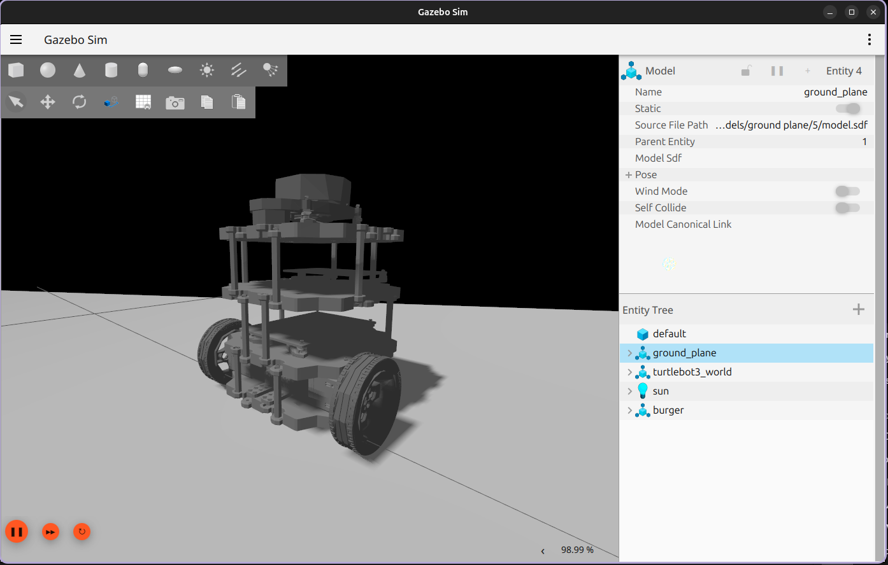
</p>

<p align="center">
  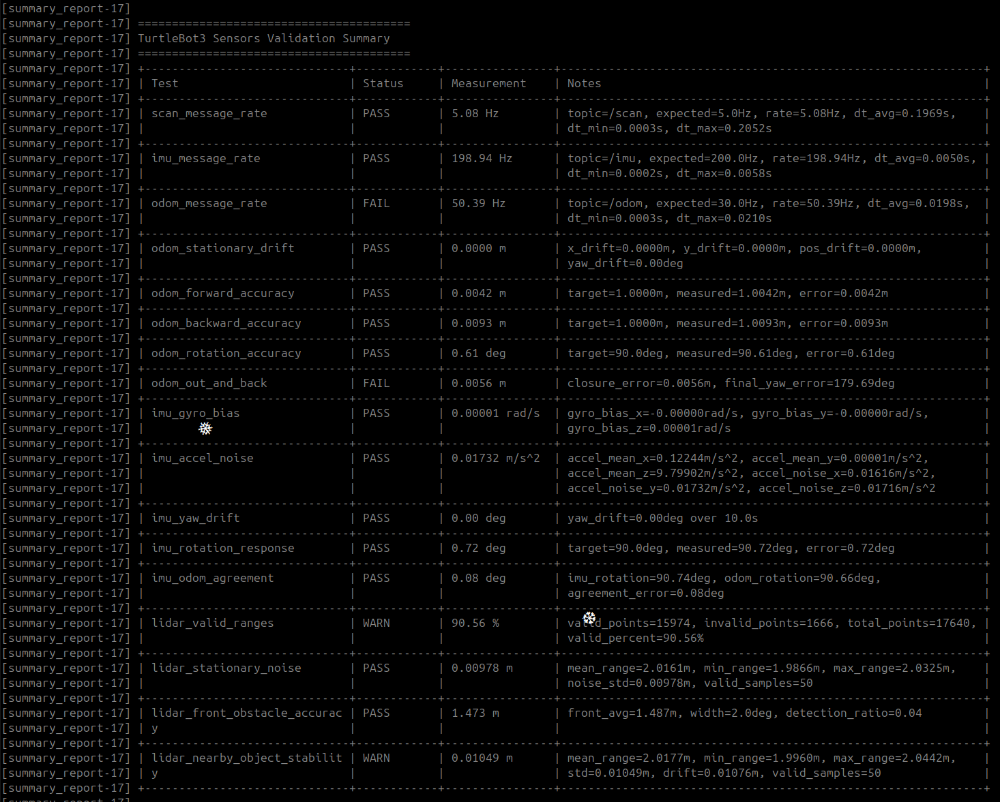
</p>

---

## Individual Tests

### Message Rate Check

```bash
ros2 run tb3_sensors_validation message_rate_check
```

<p align="center">
  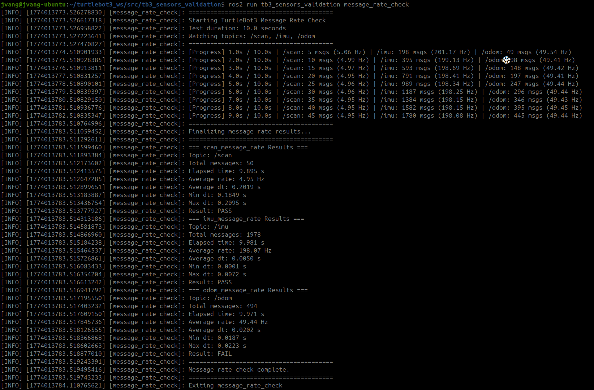
</p>

---

### Odom Stationary Drift

```bash
ros2 run tb3_sensors_validation odom_stationary_drift
```

<p align="center">
  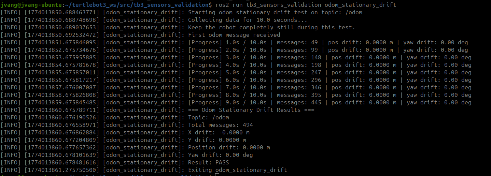
</p>

---

### Odom Forward Accuracy

```bash
ros2 run tb3_sensors_validation odom_forward_accuracy
```

<p align="center">
  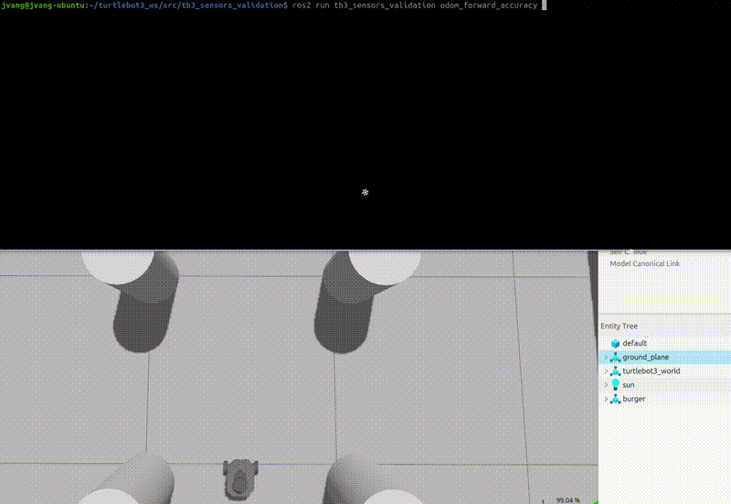
</p>

<p align="center">
  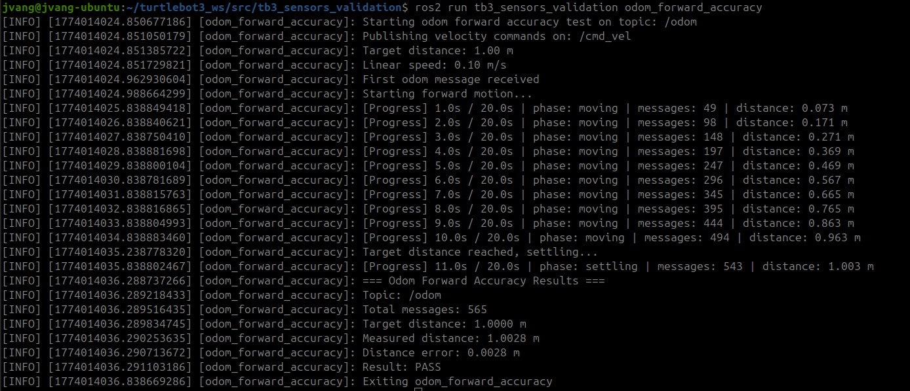
</p>

---

### Odom Backward Accuracy

```bash
ros2 run tb3_sensors_validation odom_backward_accuracy
```

<p align="center">
  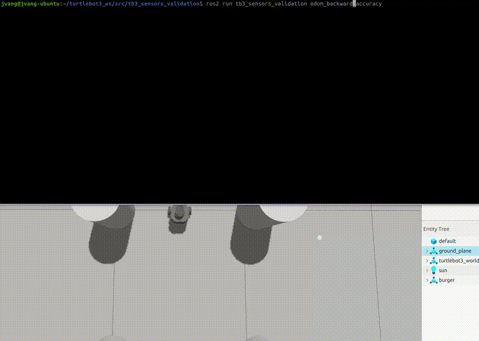
</p>

<p align="center">
  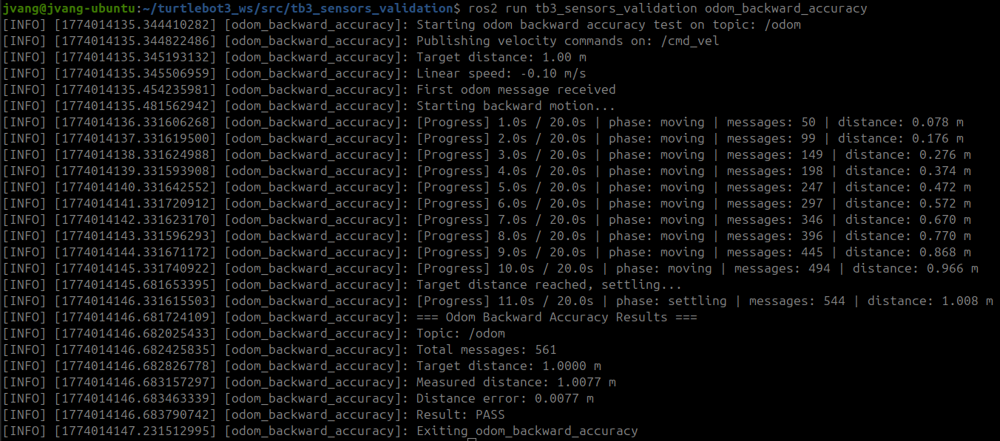
</p>

---

### Odom Rotation Accuracy

```bash
ros2 run tb3_sensors_validation odom_rotation_accuracy
```

<p align="center">
  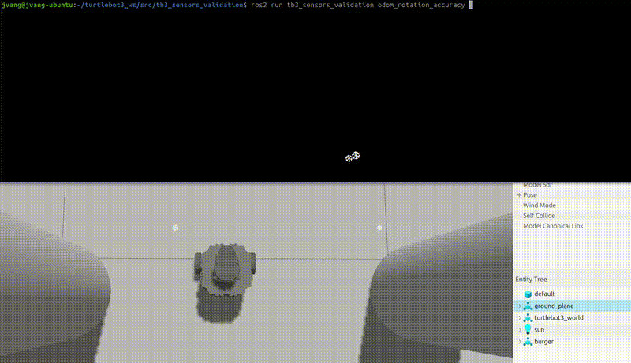
</p>

---

### Odom Out and Back

```bash
ros2 run tb3_sensors_validation odom_out_and_back
```

<p align="center">
  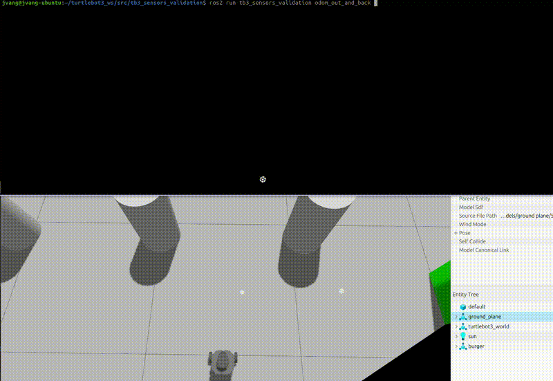
</p>

---

### IMU Gyro Bias

```bash
ros2 run tb3_sensors_validation imu_gyro_bias
```

<p align="center">
  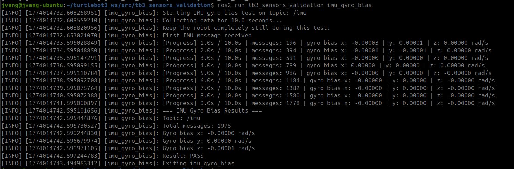
</p>

---

### IMU Accel Noise

```bash
ros2 run tb3_sensors_validation imu_accel_noise
```

<p align="center">
  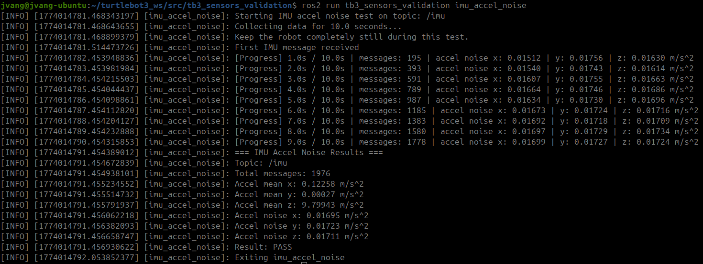
</p>

---

### IMU Yaw Drift

```bash
ros2 run tb3_sensors_validation imu_yaw_drift
```

<p align="center">
  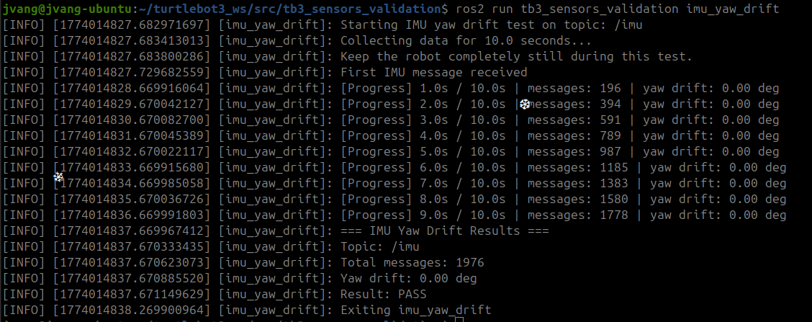
</p>

---

### IMU Rotation Response

```bash
ros2 run tb3_sensors_validation imu_rotation_response
```

<p align="center">
  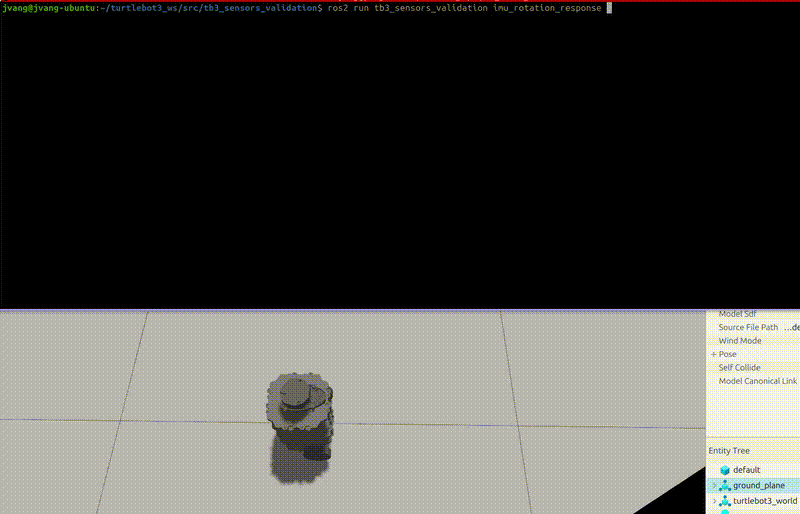
</p>

---

### IMU / Odom Agreement

```bash
ros2 run tb3_sensors_validation imu_odom_agreement
```

<p align="center">
  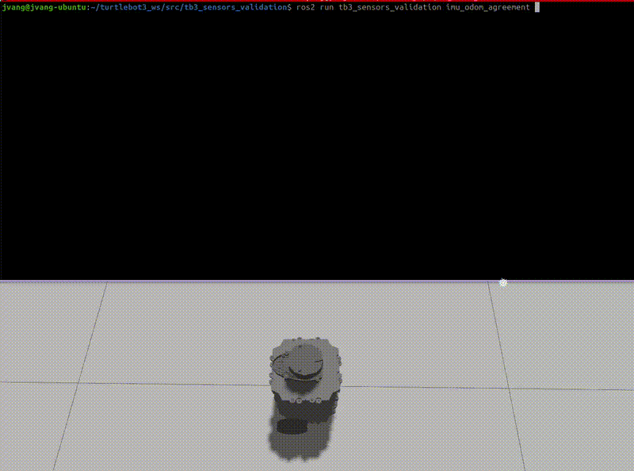
</p>

---

### LiDAR Valid Ranges

```bash
ros2 run tb3_sensors_validation lidar_valid_ranges
```

<p align="center">
  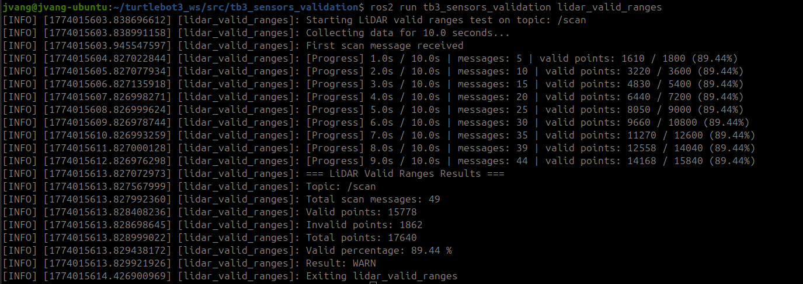
</p>

---

### LiDAR Stationary Noise

```bash
ros2 run tb3_sensors_validation lidar_stationary_noise
```

<p align="center">
  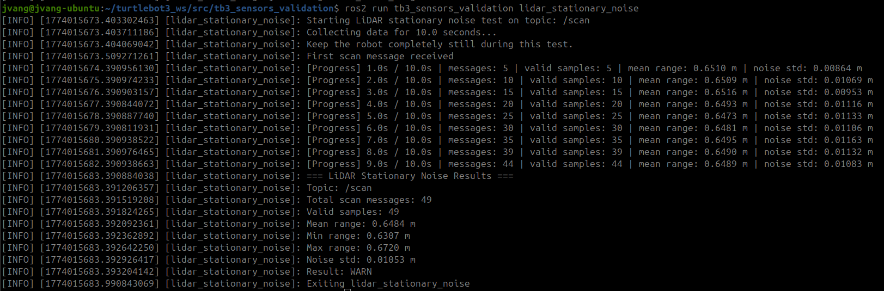
</p>

---

### LiDAR Front Obstacle Detection

```bash
ros2 run tb3_sensors_validation lidar_front_obstacle_accuracy
```

<p align="center">
  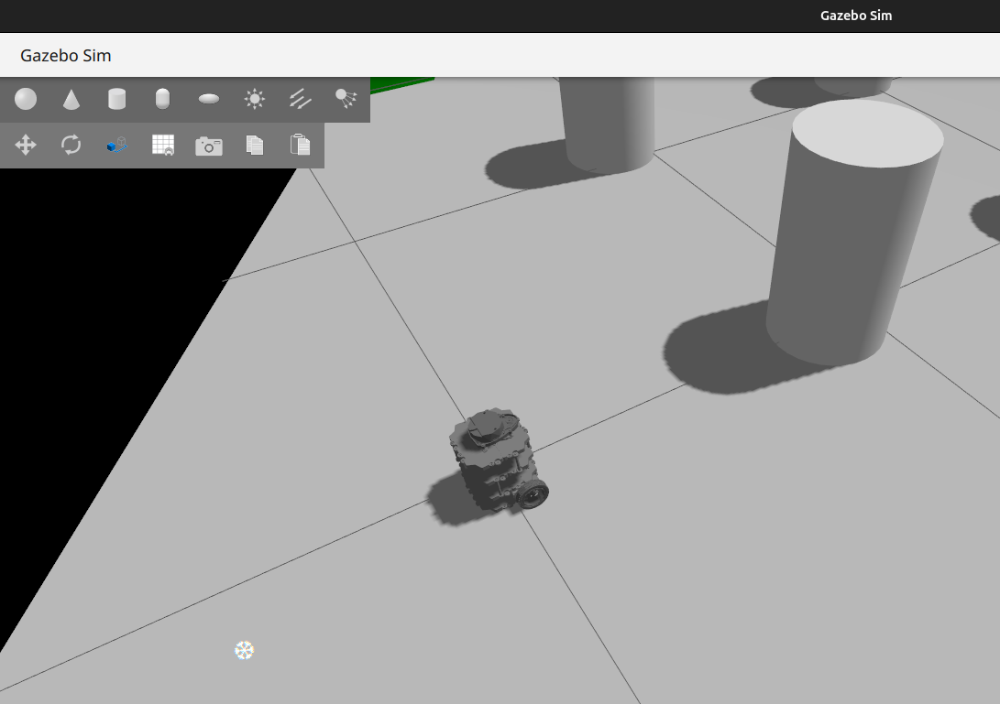
</p>

<p align="center">
  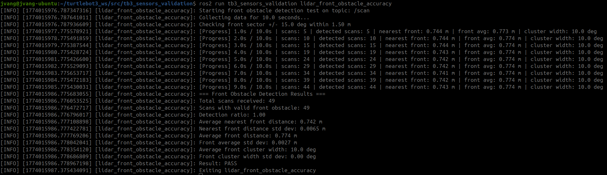
</p>

---

### LiDAR Nearby Object Stability

```bash
ros2 run tb3_sensors_validation lidar_nearby_object_stability
```

<p align="center">
  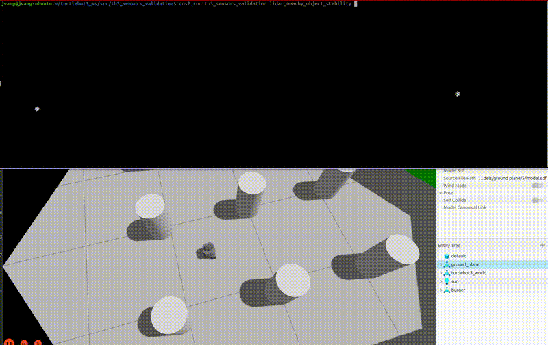
</p>


<p align="center">
  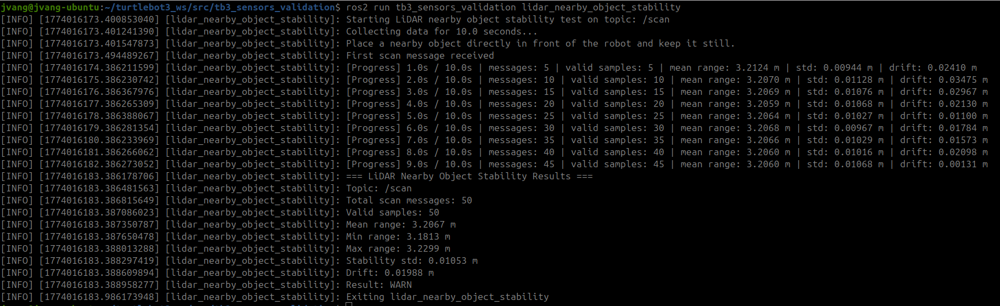
</p>

---

## Topics Used

```text
/scan
/imu
/odom
/cmd_vel
```

These tests validate the basic sensor and motion pipeline:

```text
LiDAR -> /scan -> scan validity / obstacle checks
IMU   -> /imu  -> bias / noise / yaw response
Odom  -> /odom -> drift / distance / rotation / closure
cmd_vel -> motion command -> response measured by IMU and Odom
```

---

## Why This Matters

Before debugging SLAM, AMCL, Cartographer, or Nav2, it helps to verify:

- message rates are stable
- odom does not drift badly while stationary
- forward, backward, and rotational odom behavior are reasonable
- IMU bias and noise are acceptable
- IMU and odom agree during turning
- LiDAR scans are valid and usable
- front and nearby obstacle detection behave consistently

This package gives you a practical health check for the TurtleBot3 sensing and motion stack before moving on to higher-level autonomy.

---

## Installation

```bash
cd ~/your_ros2_ws/src
git clone https://github.com/johnnyjvang/tb3_sensors_validation.git
```

```bash
cd ~/your_ros2_ws
colcon build
source install/setup.bash
```

---

## Running on Real TurtleBot3

Terminal 1:

```bash
source /opt/ros/jazzy/setup.bash
export TURTLEBOT3_MODEL=burger
ros2 launch turtlebot3_bringup robot.launch.py
```

Terminal 2:

```bash
cd ~/your_ros2_ws
source install/setup.bash
```

Run full suite:

```bash
ros2 launch tb3_sensors_validation sensors_validation_all.launch.py
```

---

## Running in Simulation

Terminal 1:

```bash
source /opt/ros/jazzy/setup.bash
export TURTLEBOT3_MODEL=burger
ros2 launch turtlebot3_gazebo turtlebot3_world.launch.py
```

Terminal 2:

```bash
cd ~/your_ros2_ws
source install/setup.bash
```

Run full suite:

```bash
ros2 launch tb3_sensors_validation sensors_validation_all.launch.py
```

---

## Expected Results

### Message Rate

```text
Stable scan, IMU, and odom rates close to expected values
Low timing variation and no missing topic output
```

### Odom

```text
Low stationary drift
Forward and backward distance close to target
Rotation close to target angle
Out-and-back returns near starting pose
```

### IMU

```text
Low gyro bias while stationary
Low accelerometer noise
Minimal yaw drift when robot is still
Rotation response tracks commanded turn well
Good agreement with odom during turning
```

### LiDAR

```text
High percentage of valid ranges
Low stationary noise
Reliable front obstacle detection
Stable nearby object measurements over time
```

---

## Package Structure

```text
tb3_sensors_validation/
├── launch/
│   └── sensors_validation_all.launch.py
├── docs/
│   ├── tb3_robot.png
│   ├── launch_summary_output.png
│   ├── message_rate_check.png
│   ├── odom_stationary_drift.png
│   ├── odom_forward_accuracy.gif
│   ├── odom_forward_accuracy.png
│   ├── odom_backward_accuracy.gif
│   ├── odom_backward_accuracy.png
│   ├── odom_rotation_accuracy.gif
│   ├── odom_out_and_back.gif
│   ├── imu_gyro_bias.png
│   ├── imu_accel_noise.png
│   ├── imu_yaw_drift.png
│   ├── imu_rotation_reponse.gif
│   ├── imu_odom_agreement.gif
│   ├── lidar_valid_ranges.png
│   ├── lidar_stationary_noise.png
│   ├── imu_front_obstacle_accuracy_robot.png
│   ├── imu_front_obstacle_accuracy_output.png
│   ├── lidar_nearby_object_stability.gif
│   ├── lidar_nearby_object_stability_robot.png
│   └── lidar_nearby_object_stability_output.png
├── tb3_sensors_validation/
│   ├── message_rate_check.py
│   ├── odom_stationary_drift.py
│   ├── odom_forward_accuracy.py
│   ├── odom_backward_accuracy.py
│   ├── odom_rotation_accuracy.py
│   ├── odom_out_and_back.py
│   ├── imu_gyro_bias.py
│   ├── imu_accel_noise.py
│   ├── imu_yaw_drift.py
│   ├── imu_rotation_response.py
│   ├── imu_odom_agreement.py
│   ├── lidar_valid_ranges.py
│   ├── lidar_stationary_noise.py
│   ├── lidar_front_obstacle_accuracy.py
│   ├── lidar_nearby_object_stability.py
│   ├── reset_results.py
│   ├── summary_report.py
│   ├── result_utils.py
│   └── __init__.py
├── package.xml
├── setup.py
├── setup.cfg
└── LICENSE
```

---

## Notes

- Some tests are purely stationary and are documented with PNG output captures.
- Motion-based tests are documented with GIFs where available.
- LiDAR front obstacle detection in this README uses the provided front obstacle images you captured.
- Real-world performance will usually vary more than simulation because of floor friction, wheel slip, and sensor noise.
- This package is meant as a foundational validation suite before using higher-level autonomy tools.

---

## License

MIT License
